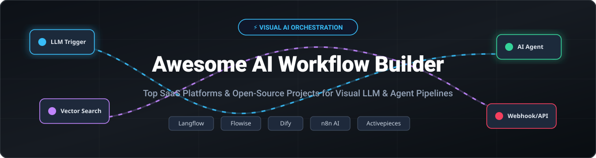

# Awesome AI Workflow Builder Ecosystem ⚡

 

**A Curated List of Top SaaS Platforms & Open-Source GitHub Projects for Visual AI Orchestration, LLM Flow Builders, Agentic Workflows, No-Code Automation & Production AI Pipelines.** 🚀

*Last updated: September 2026* 📅

Welcome to the ultimate directory of **AI Workflow Builders** 🛠️ and **Visual LLM Orchestration Engines** 🤖. Whether you are an AI engineer constructing production RAG apps, an enterprise developer building autonomous multi-agent pipelines 🧬, or a business team automating cross-application workflows without code ⚡, this list tracks the category leaders across hosted commercial platforms and self-hosted open-source software.

---

## 📑 Table of Contents
- [📊 Market Overview & Ecosystem Dynamics](#-market-overview--ecosystem-dynamics)
- [☁️ SaaS & Hosted AI Workflow Platforms](#%EF%B8%8F-saas--hosted-ai-workflow-platforms)
- [🔓 Open-Source GitHub Projects](#-open-source-github-projects)
- [⚙️ Frameworks & Custom Development](#%EF%B8%8F-frameworks--custom-development)
- [🤝 How to Contribute](#-how-to-contribute)
- [💖 Support & Sponsorship](#-support--sponsorship)
- [📈 Star History](#-star-history)
- [⚠️ Disclaimer](#%EF%B8%8F-disclaimer)

---

## 📊 Market Overview & Ecosystem Dynamics

> [!IMPORTANT]
> **Market Size & Structure**: The Global AI Workflow Automation & Visual LLM Orchestration sector is estimated at **$4.8 Billion** (2026), projecting a **34.2% CAGR** driven by enterprise agentic deployment and retrieval-augmented generation (RAG). The market is **moderately fragmented**: mainstream enterprise automation is converging around established giants (Zapier, n8n), while developer-centric visual LLM orchestration remains highly dynamic and split between venture-funded SaaS platforms and community-driven open-source software.

---

## ☁️ SaaS & Hosted AI Workflow Platforms

Below is a curated comparison of commercial SaaS products for building AI workflows, sorted in descending order by **Market Footprint & Scale** (Company Valuation / Funding / ARR). 📈

| SaaS Platform 🌐 | Market Footprint & Scale 💰 | Starting Tier Pricing 🏷️ | Free Tier / Trial Limit 🎁 | Key Capabilities & Best For 🎯 |
| :--- | :--- | :--- | :--- | :--- |
| **[Zapier AI](https://zapier.com/ai)** | **$5.0B Valuation** (~$310M+ ARR) | **$19.99/mo** (Starter plan, billed annually) | **100 tasks/month** (Free Forever Plan) | Mainstream visual automation with 7,000+ app integrations, AI Canvas, and natural language workflow builders. |
| **[n8n Cloud](https://n8n.io/)** | **$5.2B Valuation** ($100M ARR, $180M+ raised) | **$20.00/mo** (Starter plan, 2,500 executions) | **14-day Free Trial** (Includes full AI nodes & 1,000 test executions) | Enterprise-grade workflow automation with advanced LLM nodes, sub-workflows, human-in-the-loop, and native AI agents. |
| **[Dify Cloud](https://dify.ai/)** | **$180M Valuation** ($30M Series Pre-A, ~$3.1M ARR) | **$59.00/mo** (Professional plan) | **200 OpenAI messages / credits** (Free Forever Plan) | Hosted visual application & agent orchestrator with built-in RAG knowledge bases, hybrid search, and citation tracking. |
| **[Stack AI](https://www.stack-ai.com/)** | **$75M Acquisition by Asana** ($20M raised) | **$139.00/mo** (Starter plan) | **100 runs/month** (Free Forever Plan) | Enterprise-grade low-code visual agent builder with SOC2/HIPAA compliance, custom tool integrations, and on-prem support. |
| **[Workday Pipedream](https://pipedream.com/)** | **$22.4M Raised** (Acquired by Workday) | **$29.00/mo** (Basic plan) | **100 credits/month & 3 active flows** (Free Forever Plan) | Developer-centric workflow platform blending serverless code blocks (Node.js/Python) with LLM steps and event triggers. |
| **[Flowise Cloud](https://flowiseai.com/)** | **~$1M ARR** (Open-source core archived 2026) | **$35.00/mo** (Starter cloud plan) | **5 flow runs / limited sandbox** (Free Trial) | Hosted drag-and-drop UI for LangChain components, agent chains, and vector store retrieval pipelines. |
| **[BuildShip](https://buildship.com/)** | **Bootstrapped / Unfunded** (Seed stage) | **$19.00/mo** (Starter plan) | **3,000 credits/month & 5 active flows** (Free Forever Plan) | Low-code visual backend and AI flow builder for creating serverless APIs, scheduled triggers, and agent microservices. |
| **[Activepieces Cloud](https://www.activepieces.com/)** | **YC S22** ($500K raised, ~$1.7M ARR) | **$16.00/mo** (Pro plan) | **1,000 tasks/month** (Free Forever Plan) | Open-source alternative to Zapier/n8n with a hosted cloud tier featuring AI pieces, code steps, and unlimited flow runs. |

---

## 🔓 Open-Source GitHub Projects

The visual AI workflow ecosystem is heavily powered by open-source innovation. Below are top open-source projects sorted in descending order by **GitHub Star Count**. ⭐

- **[n8n](https://github.com/n8n-io/n8n)**   
  Fair-code workflow automation platform with extensive SaaS integrations and native AI/LLM nodes. Self-host for complete data privacy and custom automations. 🔒
- **[Dify](https://github.com/langgenius/dify)**   
  Open-source (Apache 2.0) production platform for LLM applications and agentic workflows featuring visual prompt canvas, RAG knowledge pipelines, and multi-tenant management. 🧠
- **[Langflow](https://github.com/langflow-ai/langflow)**   
  Leading open-source (MIT) visual framework for AI agents, RAG pipelines, and Model Context Protocol (MCP) servers. Python-backed with drag-and-drop canvas and API export. 🐍
- **[Flowise](https://github.com/FlowiseAI/Flowise)**   
  Open-source (Apache 2.0) drag-and-drop UI built for LangChain node flows, LLM agents, and custom tool orchestration. 🎨
- **[LangGraph](https://github.com/langchain-ai/langgraph)**   
  Framework for building stateful, multi-actor LLM applications with cycles, flow control, state persistence, and human-in-the-loop execution. 🔄
- **[Node-RED](https://github.com/node-red/node-red)**   
  Mature open-source visual programming tool for event-driven applications, widely extended with community LLM and OpenAI nodes for IoT & AI automations. 🌐
- **[Activepieces](https://github.com/activepieces/activepieces)**   
  Open-source (MIT) no-code business automation framework with 100+ community pieces, AI assistant actions, and zero per-execution self-hosted cost. 🧩
- **[Windmill](https://github.com/windmill-labs/windmill)**   
  Developer-first open-source workflow engine and internal tool builder supporting Python/TypeScript/Go scripts, visual flows, AI steps, and MCP support. 💻
- **[Botpress](https://github.com/botpress/botpress)**   
  Open conversational AI platform and visual execution engine for autonomous chatbots, multi-modal agents, and flow integrations. 💬
- **[AG2 / AutoGen](https://github.com/ag2ai/ag2)**   
  Open-source programming framework for agentic AI enabling multi-agent conversation, autonomous problem solving, and tool execution. 🤖
- **[CrewAI](https://github.com/crewAIInc/crewai)**   
  Cutting-edge open-source framework for orchestrating role-based, autonomous AI agents to collaborate and execute complex multi-step workflows. 👥

---

## ⚙️ Frameworks & Custom Development

When visual canvases need to be embedded or extended with programmatic control: 🛠️
- **AI-first visual orchestrators**: Langflow, Flowise, and Dify lead for custom RAG pipelines and rapid agent prototyping.
- **General automation + AI**: n8n and Activepieces are ideal when workflows span external SaaS tools, CRMs, webhooks, and LLMs.
- **Code-first agent frameworks**: LangGraph, AG2 (AutoGen), and CrewAI provide pythonic graph control, memory management, and multi-agent coordination.
- **Composable stack architecture**: Visual Builder UI → Self-hosted LLM/Embedding Models → Vector DB (Qdrant/Milvus/Pinecone) → Webhook Trigger / REST API Endpoint.

---

## 🤝 How to Contribute

Contributions are welcome! Please follow these guidelines: ✨
1. Fork the repository.
2. Edit `README.md` following the tabular or bullet format.
3. Ensure all links, pricing details, and star counts are factual and up to date.
4. Submit a Pull Request with a short summary of changes.

---

## 💖 Support & Sponsorship

Thank you for exploring this curated collection! If you find this resource helpful for building your AI workflows or discovering awesome projects, please consider giving it a ⭐ **Star**, sharing it with your network, or contributing new tools!

If you'd like to support the ongoing maintenance and creation of awesome open-source resources, feel free to buy me a coffee via GitHub Sponsors:

---

## 📈 Star History

---

## ⚠️ Disclaimer

- This directory is **community-curated** for informational purposes.
- AI workflow automation engines execute actions, query databases, and call external APIs. Always use API key scope limits, staging environments, and human approval steps for production deployments.
- Open-source tools eliminate per-run licensing fees but require infrastructure management, scaling, and security governance.

---

<b>Maintained with ❤️ for AI Engineers, Automation Architects, and Teams Building Next-Gen Agentic Workflows.</b>

